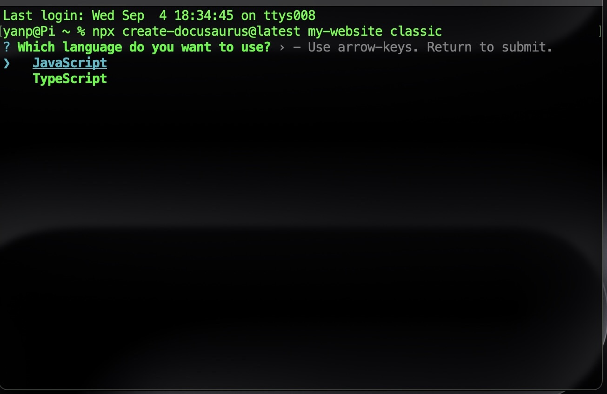
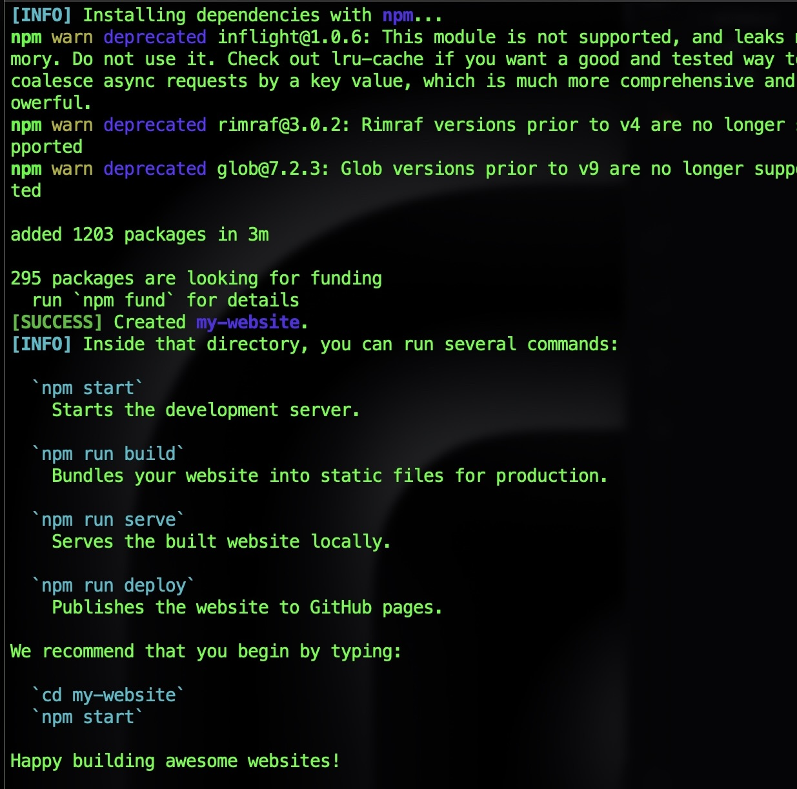
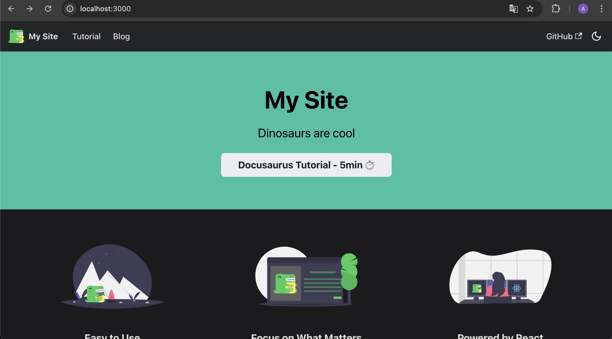

---
slug: first-blog-by-docusaurus
title: 通过Docusaurus搭建个人博客
# authors: [EL]
tags: [project,blog,docusaurus]
---

### 为什么选择通过Docusaurus搭建个人博客
- Docusaurus是一个静态网站生成器
- 免费 快速 对小白友好

<!--truncate-->

### 前期准备
- IDE 这里我用的是[vs code](https://code.visualstudio.com/Download)
- [Node.js](https://nodejs.org/en/download/)
- 一个[GitHub](https://github.com/)账号
- [git](https://git-scm.com/downloads)

### 安装Docusaurus

打开终端 选择你要存放这个项目的位置  
`cd '这里写文件地址' `  

输入以下命令：  
`npx create-docusaurus@latest my-website classic`    

  

显示这些就代表安装成功啦  

  

在vs code中打开上面创建的项目  
新建终端 输入：
`npm run start`  

运行成功后会出现: http://localhost:3000 地址  

打开如下图所示 这样我们的网站就建立成功啦  

