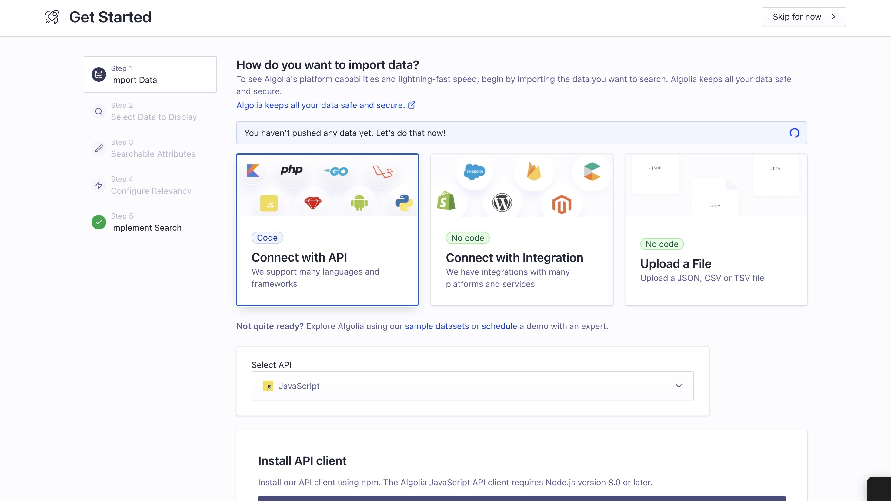
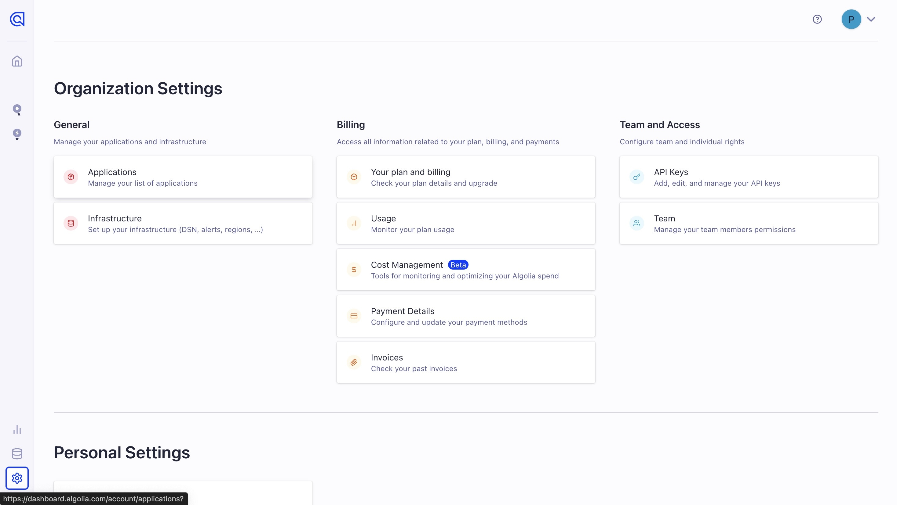
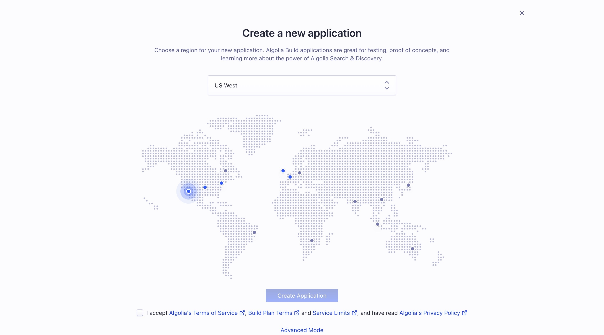
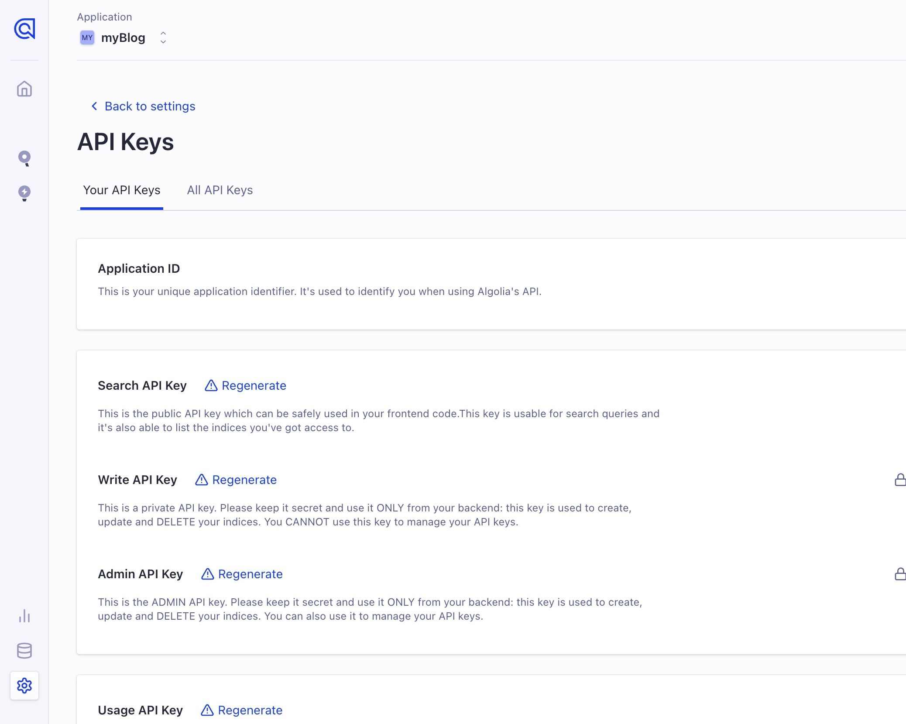
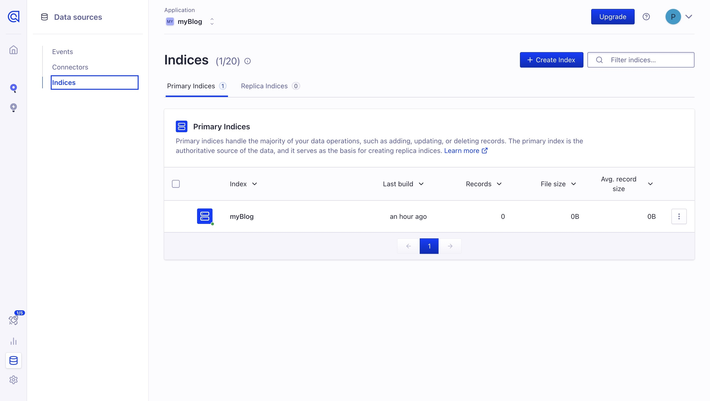
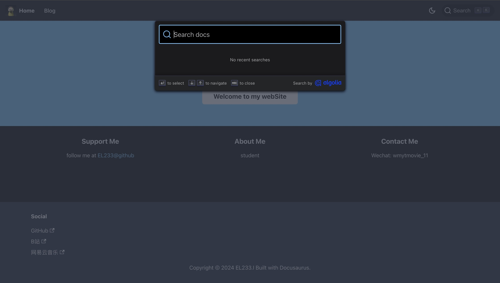

---
slug: search-by-algolia
title: 基于algolia实现站内搜索
# authors: [EL]
tags: [blog,algolia,docusaurus]
---

## 配置索引

首先向[DocSearch](https://docsearch.algolia.com/apply/)申请你的项目  

成功后会给你发邮件确认✅  

<!-- truncate -->

## 注册algolia

注册[algolia](https://www.algolia.com/)，这时候应该会跳出get start画面，可以忽略。  
  

回到主页面，点击左下角settings，点击applications，create application。  
  

选择数据节点，这里我选择的是US West。  
  

创建成功后我们可以获取API Keys。  
  

点击左下角Data sources，Create Indices，设置一个indices name。  
  

## 连接algolia

因为Docusaurus 的 @docusaurus/preset-classic 自带 Algolia DocSearch 集成。  
所以如果你用的是经典预设，就不需要额外安装任何东西。  
可以回到你的项目，在 docusaurus.config.js 中的 themeConfig 中添加一个 algolia 字段。    
```
algolia: {
        // Algolia 提供的 application ID
        appId: 'YOUR_APP_ID',

        //  公开 API 密钥：提交它没有危险
        apiKey: 'YOUR_SEARCH_API_KEY',
  
        indexName: 'YOUR_INDEX_NAME',
  
        // 可选：见下文
        contextualSearch: true,
      },
```  

如果你用的不是经典预设，首先安装软件包：  
`npm install --save @docusaurus/theme-search-algolia`  

然后在 docusaurus.config.js 中注册主题：  
```
export default {
  // ...其他配置
  themes: ['@docusaurus/theme-search-algolia'],
  themeConfig: {
    // ...
  },
};
```
再按照上面的步骤添加一个 algolia 字段。  

这样search功能就完成啦。  
  

- 更多内容可参考[docusaurus](https://docusaurus.io/zh-CN/docs/next/search)官网