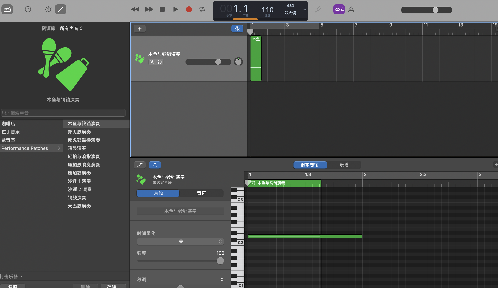

---
slug: woodenfish-app
title: 写一个敲木鱼App
# authors: [EL]
tags: [project, blog, swift]
---

### 一个敲木鱼App

- 一个极简的敲木鱼App 功能非常纯粹 

- 点击木鱼 功德计数器加1 聆听纯粹的木鱼敲击声

- 作为swift的入门练习

<!-- truncate -->
### 前期准备

- [IDE] [Xcode](https://developer.apple.com/xcode/) (在App Store即可下载)
- [硬件] 一台Mac 以及一台用于真机测试的iPhone (可选)
- [技术] 对Swift和SwiftUI有最基础的了解

### 创建Xcode项目

### 搭建UI界面

界面非常简单 只有木鱼图片和一个功德计数文本

在`ContentView.swift`文件中 我们可以用一个 `VStack` 来垂直布局这两个元素

加了`.resizable()`确保图片可以缩放

使用`scaleEffect(scale)`来控制点击时的缩放动画

```swift
   var body: some View {
        VStack(spacing: 30) {
            Text("功德：\(count)")
                .font(.largeTitle)
                .bold()

            Image("woodfish")
                .resizable()
                .frame(width: 100, height: 80)
                .scaleEffect(scale)
                .onTapGesture {
                    withAnimation(.easeOut(duration: 0.1)) {
                        scale = 0.9
                    }
                    DispatchQueue.main.asyncAfter(deadline: .now() + 0.1) {
                        withAnimation {
                            scale = 1.0
                        }
                        count += 1
                        playSound()
                    }
                }
        }
        .padding()
    }
```

### 音效实现

我们可以直接用库乐队的木鱼音效作为此app的音效素材:

  

### 真机测试效果

  

  

  


