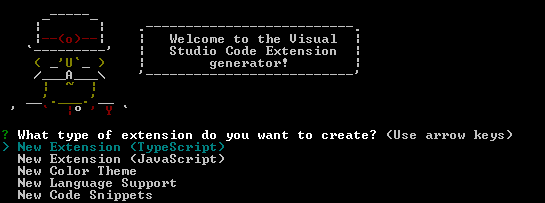

---
slug: project-autotree
title: 自动生成项目结构树
# authors: [EL]
tags: [project,typescript]
---

### 一个vs code插件

起因是写东西的过程中，想要清晰的查看自己的项目结构，脑袋突然一闪“那我为什么不直接写一个插件给自己用呢”。
于是直接开始。
ps:在扩展库搜索`AutoPJTree`就可以直接安装使用喔，插件详细可以看我GitHub[🔗](https://github.com/EL233/AutoTree)
<!-- truncate -->
### 前期准备

首先安装好[Node.js](https://nodejs.org/en)和[Git](https://git-scm.com)
再来安装[Yeoman](https://yeoman.io)和[VS Code Extension Generator](https://www.npmjs.com/package/generator-code)

第一步安装脚手架工具：
```bash
npm install -g yo generator-code
```
作用：
全局安装 yo（Yeoman） 和 generator-code。
Yeoman 是一个项目模板生成器框架，而 generator-code 是它的插件，用来生成 VS Code 扩展项目。

安装完成后，你会在命令行中获得 yo 命令。

第二步：创建 VS Code 插件模板
```bash
yo code
```
接下来它会询问一系列问题：
插件名称（Extension name）
标识符（Identifier）
描述（Description）
作者名
是否使用 TypeScript
是否添加 Git 初始化等
  

按需填好字段后它会生成一个目录结构，比如：
```
my-extension/
├── .vscode/
│   └── launch.json
├── src/
│   └── extension.ts
├── package.json
├── tsconfig.json
└── README.md
```

进入生成的目录：
```bash
cd my-extension
```
打开vs code，按 F5 启动调试，会自动启动一个新的 VS Code 窗口加载初始插件。

### 在`extension.ts`里进行插件功能的编辑。

比如我这个自动生成树的逻辑：
1、计算最大深度
函数`computeProjectMaxDepth()`用来计算整个项目的实际层级深度。
它递归扫描目录结构，忽略掉指定的文件夹。返回值为项目的最大层级。
```ts
if (stat.isDirectory()) {
  const subDepth = computeProjectMaxDepth(fullPath, ignore, currentDepth);
  if (subDepth > maxDepth) {
    maxDepth = subDepth;
  }
}
```

2、生成目录树文本
函数`generateTree()`用来生成类似 tree 命令输出的文本。
代码中通过缩进控制层级：
```ts
const indent = level === 0 ? '' : '│   '.repeat(level - 1) + '├── ';
```

使用递归：
```ts
if (stat.isDirectory()) {
  out += generateTree(itemPath, ignore, depth, level + 1);
}
```

通过`getConfigSources()`从两种配置来源（工作区配置、用户配置）中获取设置。
1.、读取 VS Code 的配置对象：
```ts
const cfg = vscode.workspace.getConfiguration('autotree');
```

2、通过 inspect 分别读取不同层级的配置：
```ts
const workspaceIgnore = cfg.inspect<string[]>('ignore')?.workspaceValue || [];
const userIgnore = cfg.inspect<string[]>('ignore')?.globalValue || [];
```

3、检查是否有多处配置（用来决定后续是否弹出选择框）：
```ts
const hasMultiple = hasWorkspaceConfig && hasUserConfig;
```

4、返回两个 ConfigSource 对象。

### 在`package.json`里编辑插件的名称、描述信息、版本信息等。

`name`扩展的包名 必须全局唯一，发布时会变成 `<publisher>.<name>`   
`displayName`在 VS Code 插件市场显示的名字（可以更友好）  
`description`插件的描述信息  
`version`当前版本号（发布时用于更新）  

其中有一个引擎兼容性，用来告诉 VS Code 这个插件需要的最低版本。
如果后续在打包过程中有相关报错信息，可以在这里修改成对应的版本：
```json
"engines": {
  "vscode": "输入对应的版本号"
}
```

激活事件：定义插件何时被激活
```json
  "activationEvents": []
```
常见触发方式：
"onStartupFinished"：VS Code 启动后加载。
"onCommand:xxx"：用户执行某个命令时加载。
"onLanguage:python"：打开某种语言文件时加载。
"*"：总是加载（不推荐，会影响性能）。

主入口：
```json
"main": "./dist/extension.js",
```
指定插件的入口文件路径（编译后）。
默认是 src/extension.ts 编译出来的 JS 文件。

### 一些杂乱的
原本把问题想的很简单，只需要完成递归生成树就好了，实际操作中才能意识到很多需要改进的地方。
比如需要忽略掉某些文件夹/文件，有时候不需要查看那么深的结构，手动设置步骤很繁琐，每次都要重新来一遍。
为此增加了多种设置方法：项目设置 (.vscode/settings.json)、工作区设置、用户设置 (全局)。以及递归深度限制。
过程中又遇到问题，比如我在项目设置与工作区设置不一样，又或者我是提前设置好了，但临时改主意想要手动设置不一样的。
于是我加入了配置优先级，对他们进行排序，避免了用户设置冲突的问题。
现在这个版本我目前比较满意吧，如果后续使用过程中遇到新的问题或改进之处，会继续更新的。