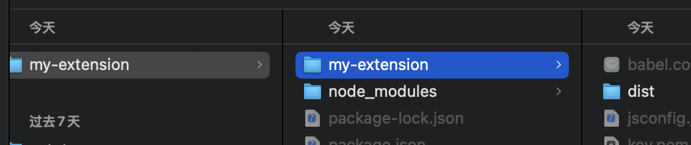
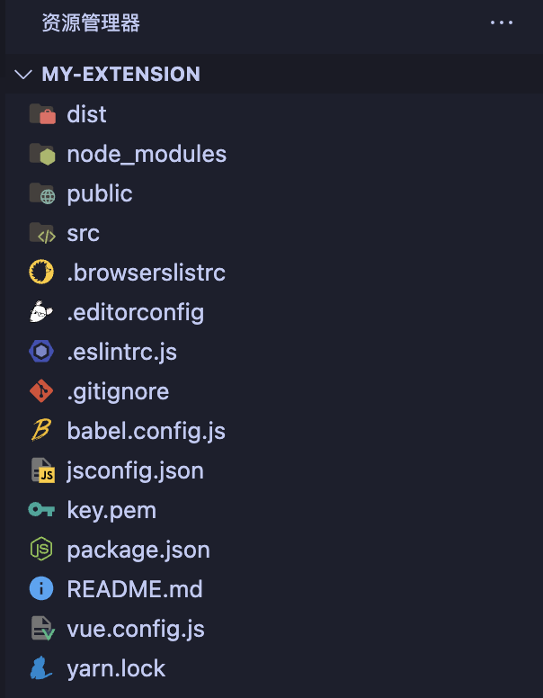
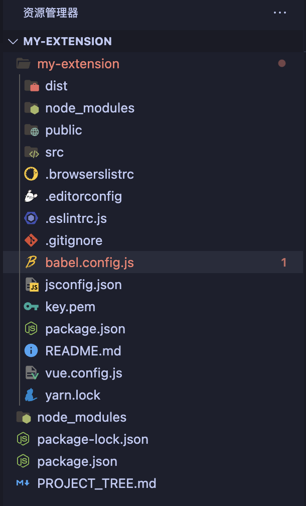

---
slug: eslint-error
title: Parsing error No Babel config file detected
# authors: [EL]
tags: [project,chrome,vue]
---
<!-- truncate -->
### 起因

本人正在试图用vue开发chrome插件，刚配置好环境，用vs code打开文件后就发现报错信息`Parsing error: No Babel config file detected`。  
奇怪的是我明明就有`/babel.config.js`文件。遂提问小G，ta说只要在文件里加上一句`requireConfigFile: false,`就可以了，  
于是我改成这样：
```js
module.exports = {
  presets: [
    ['@vue/cli-plugin-babel/preset', { requireConfigFile: false }]
  ]
}
```

并且同步修改了`/.eslintrc.js`文件：
```js
parserOptions: {
    parser: '@babel/eslint-parser',
    requireConfigFile: false
  },
```

报错的确是消失了，可是我突然意识到，同时我的Babel的配置也失效了。

再一番搜索后得知：`babel.config.js` 必须在项目根目录，于是我还原两个文件后重新打开项目，使得此文件处在根目录下，报错果然消失了。  
即编辑器打开的目录并不等于运行项目的目录，ta对根部的理解就是表面上打开文件的层级最上部。  
ESLint判断“项目根目录”时，并不是根据磁盘路径，而是根据你在编辑器里打开的文件夹作为 Workspace根。  
以下是图解：  
  
  
  

