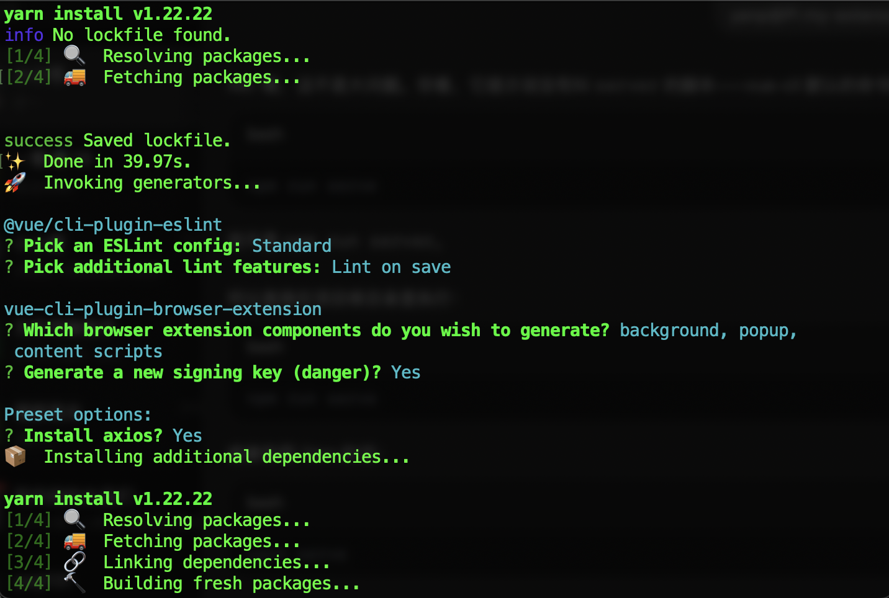
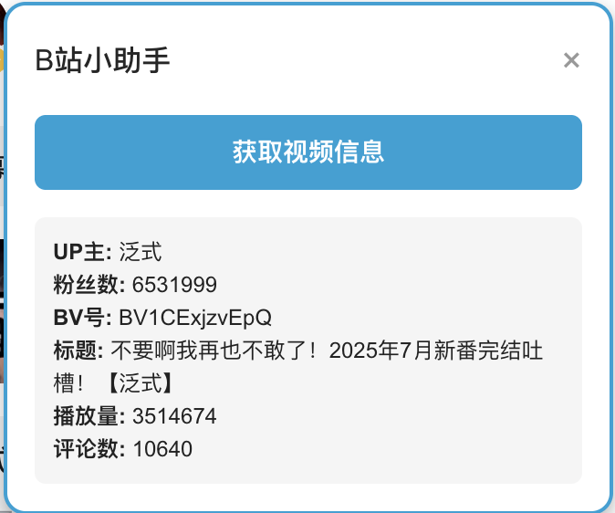
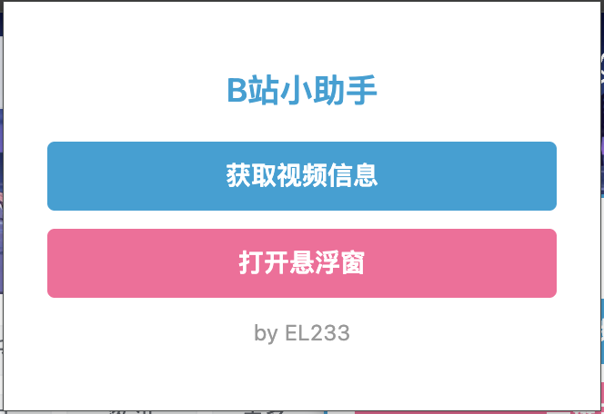

---
slug: chrome-extension
title: 自动获取b站视频信息
# authors: [EL]
tags: [project,chrome,vue]
---
<!-- truncate -->
### vue开发chrome插件

### 环境配置
```bash
# 安装 Vue CLI
npm install -g @vue/cli
npm install -g @vue/cli-init
# 创建 Vue Web Extension 项目
vue create --preset kocal/vue-web-extension my-extension
cd my-extension
# 启动本地开发服务器
npm run server
```



### Vue版本确认
我使用的是Vue2
```bash
npm list vue
```

### 安装 elementUI
```bash
npm install element-ui --save
```

在`main.js`中引入：
```js
import Vue from 'vue'
import App from './App.vue'
import ElementUI from 'element-ui'
import 'element-ui/lib/theme-chalk/index.css'

Vue.use(ElementUI)

new Vue({
  el: '#app',
  render: h => h(App)
})

```

### 安装 Tailwind CSS
使用与兼容的 Vue2+Webpack 的旧版 Tailwind
```bash
npm install tailwindcss@npm:@tailwindcss/postcss7-compat postcss@^7 autoprefixer@^9
```

### 配置postcss.config.js 文件

```js
module.exports = {
  plugins: {
    '@tailwindcss/postcss': {},
    autoprefixer: {}
  }
}
```

### 配置tailwind.config.js 文件

```js
/** @type {import('tailwindcss').Config} */
module.exports = {
  content: [
    './public/**/*.html',
    './src/**/*.{vue,js,ts,jsx,tsx}'
  ],
  theme: {
    extend: {}
  },
  plugins: []
}
```

### 升级 manifest 版本
在`manifest.json`修改字段
```bash
"manifest_version": 3
```

### 插件功能设计

- 获取视频信息  
getVideoInfo()会调用b站API获取信息：
```js
async function getVideoInfo () {
  const videoApi = `https://api.bilibili.com/x/web-interface/view?bvid=${bvid}`
  const videoRes = await fetch(videoApi)
  const videoData = await videoRes.json()

  const title = videoData.data.title
  const view = videoData.data.stat.view
  const reply = videoData.data.stat.reply
  const mid = videoData.data.owner.mid
  const upName = videoData.data.owner.name

  const upApi = `https://api.bilibili.com/x/relation/stat?vmid=${mid}`
  const upRes = await fetch(upApi)
  const upData = await upRes.json()
  const follower = upData.data.follower

  // 更新悬浮窗
  infoDisplay.innerHTML = `
    <p><strong>UP主:</strong> ${upName}</p>
    <p><strong>粉丝数:</strong> ${follower}</p>
    <p><strong>BV号:</strong> ${bvid}</p>
    <p><strong>标题:</strong> ${title}</p>
    <p><strong>播放量:</strong> ${view}</p>
    <p><strong>评论数:</strong> ${reply}</p>
  `
}
```

为什么用API而不是DOM：  
1.使用官方 API，可以直接获取完整、实时、可靠的数据  
2.从API获取的JSON中直接包含了JSON 不用解析DOM  

- 一键三连  
模拟手动长按按钮3秒实现：
```js
function realTripleLike () {
  const likeBtn = document.querySelector('.video-like') || document.querySelector('button.like')
  if (!likeBtn) return alert('未找到点赞按钮')

  likeBtn.dispatchEvent(new MouseEvent('mousedown', { bubbles: true }))
  setTimeout(() => {
    likeBtn.dispatchEvent(new MouseEvent('mouseup', { bubbles: true }))
    alert('一键三连成功！')
  }, 3000)
}
```

- 发送评论  
调用b站API发送配置好的评论：
```js
async function sendComment () {
  const csrf = getCSRF()
  const bvid = getBvid()
  const text = window.__bili_comment__ || '好耶！'
  
  await bilibiliPost('https://api.bilibili.com/x/v2/reply/add', {
    oid: bvid,
    type: 1,
    message: text,
    csrf
  })
  alert('评论发送成功！')
}
```

### 弹窗样式
这里因为elementui的按钮组件自带样式导致我的弹窗按钮无法对齐  
于是添加`!important`到样式，强制覆盖其默认样式  
添加`box-sizing: border-box !important`确保宽度计算包含内边距和边框  
效果图如下：  
  


### popup → content-script 通信
Vue popup 发送消息到 content-script:
```js
chrome.tabs.query({ active: true, currentWindow: true }, (tabs) => {
  chrome.tabs.sendMessage(tabs[0].id, { action: 'get_video_info' })
})
```

content-script接收消息并处理：
```js
chrome.runtime.onMessage.addListener((msg, sendResponse) => {
  if (msg.action === 'get_video_info') getVideoInfo()
  if (msg.action === 'open_floating_box') createFloatingBox()
  if (msg.action === 'triple_action') realTripleLike()
  return true
})
```
