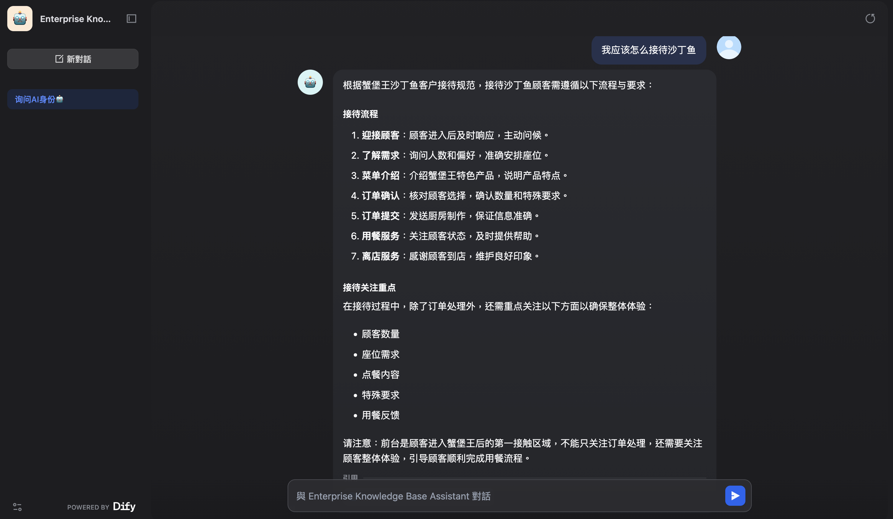
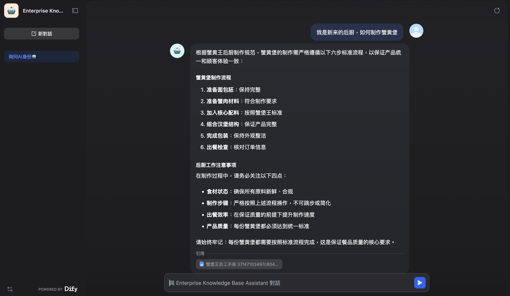

---
slug: enterprise-knowledge-assistant
title: 企业知识助手搭建
# authors: [EL]
tags: [project,AI,RAG,knowledge-base]
---

### 企业知识助手介绍

企业知识助手是一款基于企业知识库构建的 AI 问答助手。

通过整理企业内部文档、规范、流程等资料，让用户可以通过自然语言快速查询相关信息，提高知识检索效率。

<!--truncate-->

### 技术栈
- **AI 应用框架：** Dify

- **大语言模型：** DeepSeek

- **知识库方案：** RAG（Retrieval-Augmented Generation，检索增强生成）

- **向量检索：** Dify 内置知识库检索能力

- **文本处理：** 文档解析、文本切片、Embedding 向量化

- **数据存储：** 向量数据库（用于存储知识文档特征向量）

- **Prompt 工程：** 自定义角色设定、回答规则、知识库约束

- **部署方式：** 基于 Web 应用部署

### 功能特点

- 基于企业知识库内容进行回答
- 支持自然语言提问
- 降低企业内部信息查找成本
- 帮助员工快速获取业务资料

### 使用方式

访问企业知识助手：

-点击[此处🔗](https://udify.app/chat/fHilF014keZvVYrr)进入企业知识助手

输入你的问题后，助手会根据已有知识库内容进行检索并生成回答。

### 应用场景

- 企业制度查询
- 员工培训资料检索
- 产品文档查询
- 项目流程说明
- 内部知识共享

### 项目展示

该项目基于知识库 + 大语言模型实现，通过 RAG（检索增强生成）方式连接企业文档，让 AI 回答更加贴合实际业务内容。